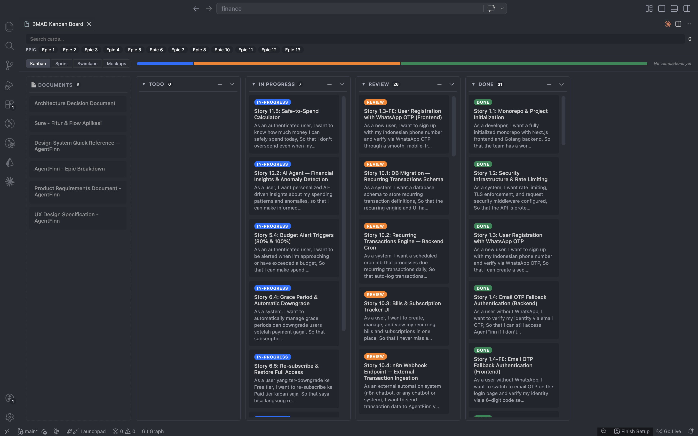
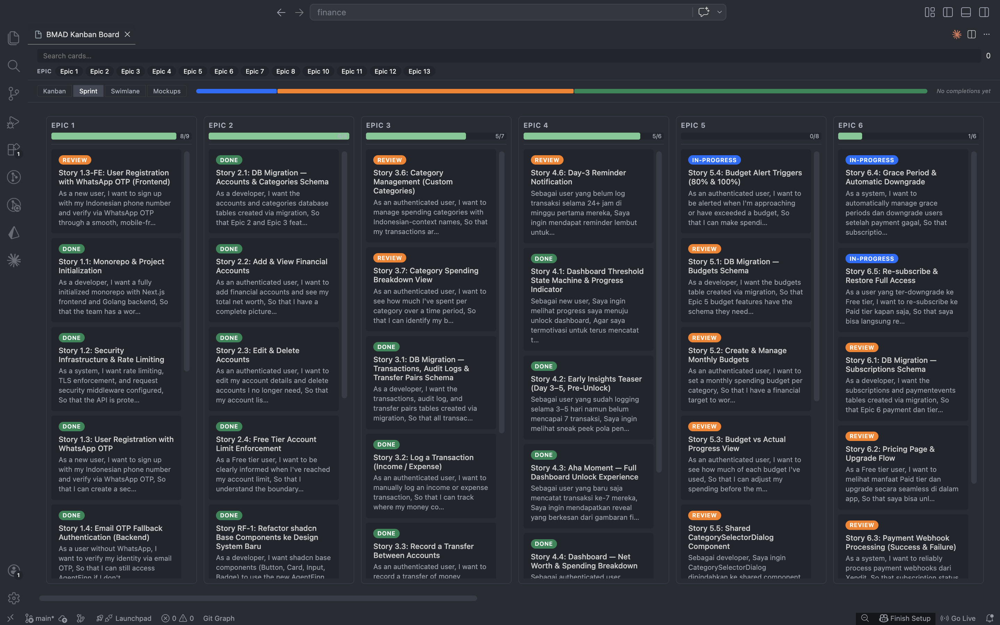
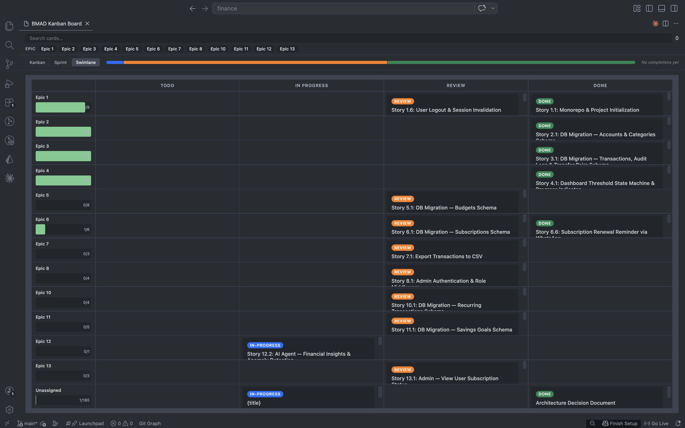
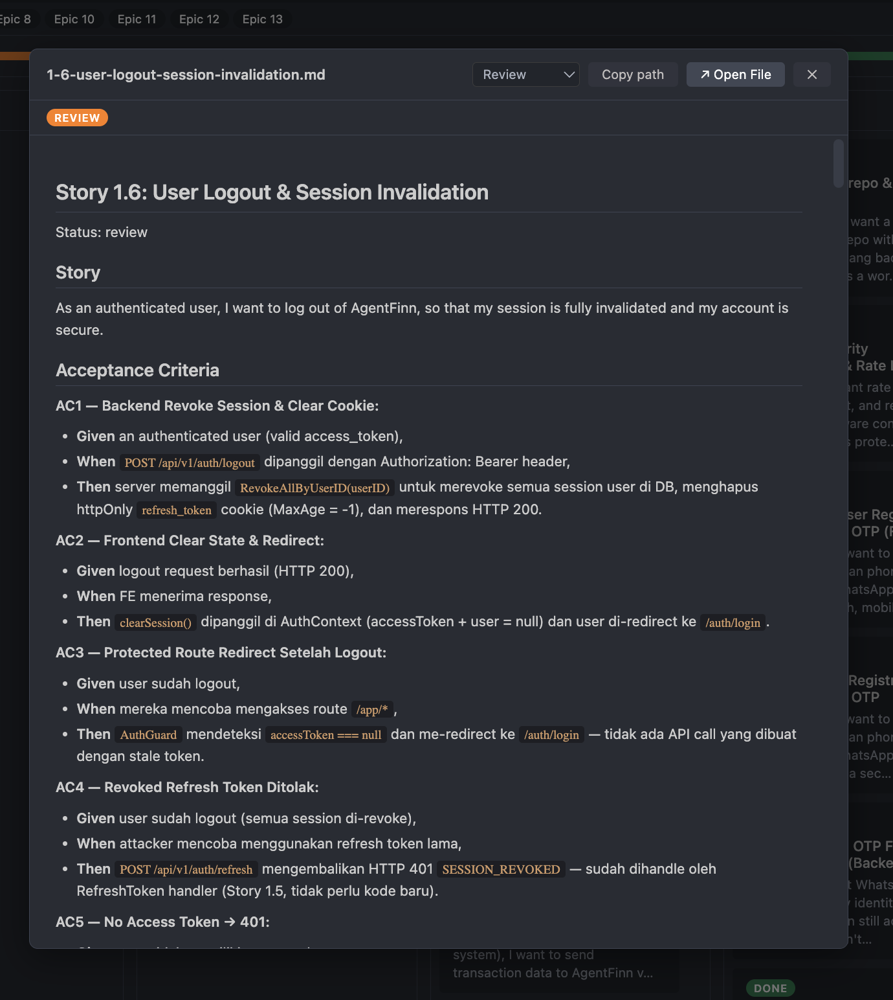

# BMAD Kanban Board

A VS Code extension that renders a full-featured Kanban board for projects built with the [BMAD Method](https://github.com/bmadcode/bmad-method). Visualize and manage story workflow state directly inside VS Code — no Jira, no Trello, no context switching.



---

## Table of Contents

- [Getting Started](#getting-started)
- [Board Views](#board-views)
  - [Mockups View](#mockups-view)
- [Filter & Search](#filter--search)
- [Card Detail Modal](#card-detail-modal)
- [Column Controls](#column-controls)
- [Workflow Features](#workflow-features)
- [Stats & Insights](#stats--insights)
- [Workspace Setup](#workspace-setup)
  - [Auto-detection](#auto-detection)
  - [Custom folder paths](#custom-folder-paths)
- [Story File Format](#story-file-format)
- [Development](#development)
- [Architecture](#architecture)

---

## Getting Started

1. Open a BMAD workspace in VS Code
2. Open the Command Palette (`Cmd+Shift+P` / `Ctrl+Shift+P`)
3. Run **BMAD: Open Kanban Board**
4. The board opens as a WebView panel showing all your stories grouped by status

The board auto-refreshes whenever a `.md` file inside a watched artifact folder or `sprint-status.yaml` changes on disk.

---

## Board Views

The board toolbar contains a **Kanban / Sprint / Swimlane / Mockups** segmented control to switch between layouts. The **Mockups** tab is only visible when a `mockups/` or `_mockups/` folder exists in the workspace.



### Kanban View (default)

The classic status-column layout. Stories are grouped into four columns:

| Column          | Status values that map to it                                   |
| --------------- | -------------------------------------------------------------- |
| **Todo**        | `todo`, `to-do`, `backlog`, `planning`, `not started`          |
| **In Progress** | `in-progress`, `in progress`, `wip`, `active`, `ready-for-dev` |
| **Review**      | `review`, `in review`, `ready for review`, `ready for merge`   |
| **Done**        | `done`, `completed`, `finished`, `merged`, `deployed`          |

A **Documents** column (left side, dashed border) holds all `.md` files sourced from the `planning-artifacts/` folder.


### Sprint View

Groups cards by **epic** from `sprint-status.yaml` key order. Each epic appears as a column with a **done/total progress bar** in its header, ordered numerically (Epic 1, Epic 2…). Cards with no matching epic appear under **Unassigned**.

### Swimlane View

Renders a 2D grid: **rows = epics**, **columns = statuses**. Epics are inferred from `sprint-status.yaml` key order (not frontmatter). Each cell shows cards matching that epic × status pair. Epic rows have a progress bar. Cells accept drag-and-drop. Cards with no matching epic appear in an **Unassigned** row.



### Mockups View

Displays all files from the `mockups/` or `_mockups/` folder as a grid of cards. This tab is hidden when no mockups folder exists.

- **`.md` mockups** — click to open the preview modal
- **`.html` mockups** — click to open in your default browser

---

## Filter & Search

A filter bar sits above the board at all times.

| Feature            | How to use                                                                                                                                                        |
| ------------------ | ----------------------------------------------------------------------------------------------------------------------------------------------------------------- |
| **Search**         | Type in the search box — filters cards by title, ID, and all metadata fields (150ms debounce)                                                                     |
| **Epic chips**     | Click an epic name to show only cards in that epic; click again to deselect. Epics are sourced from `sprint-status.yaml` and sorted numerically (Epic 1, Epic 2…) |
| **Assignee chips** | Filter by story assignee                                                                                                                                          |
| **Tag chips**      | Filter by the `tags`, `tag`, or `label` metadata field                                                                                                            |
| **Clear all**      | Click "Clear all" (appears when any filter is active) to reset everything                                                                                         |

Chip groups are hidden when no stories have that field. The card count badge on each column header updates to reflect the filtered count.

---

## Card Detail Modal

Click any card to open a preview modal with the full rendered story content.



### Card Description

Each card displays a short plain-text preview extracted from the `## Story` or `## User Story` section of the file (first 3 lines, max 120 characters). Cards without that section show no description.

### Open Links

Links inside the detail modal are intercepted:

- **Relative or absolute `.md` paths** → opens the file in the VS Code editor
- **`https://` links** → opens in the default browser
- **`file://` links** → resolved and opened in the editor

### Inline Status Change

A dropdown in the modal header shows the card's current column. Selecting a different status moves the card immediately (same as drag-and-drop) and closes the modal.

### Effort Estimate Bar

When a story has an `estimated_effort`, `estimate`, or `effort` metadata field, a visual range bar is shown below the metadata row. The bar uses a 0–40 hour scale.

- `"8-12 hours"` → fills from the 8h mark to the 12h mark
- `"10 hours"` → shows a point marker at 10h
- Values above 40h clamp to full width

### Copy File Path

The **Copy path** button in the modal toolbar writes the story's absolute file path to the clipboard. The button label changes to **✓ Copied!** for 2 seconds.

### Linked Story Chips

If a story has a `related:` metadata field (comma-separated story IDs), the modal shows a chip for each ID. Clicking a chip navigates the modal to that story's preview. Chips for unknown IDs are greyed out.

### Open in Editor

The **↗ Open File** button opens the story `.md` file in the VS Code editor.

---

## Column Controls

### Collapse / Expand

Click the **▼/▶** toggle in a column header to collapse the column to a 44px-wide strip. Collapsed columns show their total card count (not the filtered count) so hidden work remains visible. Drag-and-drop is disabled for collapsed columns.

### Per-Column Sort

A sort selector in each column header reorders cards:

| Option       | Behaviour                                                       |
| ------------ | --------------------------------------------------------------- |
| **—** (none) | Default file-discovery order                                    |
| **Title**    | Alphabetical A → Z                                              |
| **Date**     | Newest first (uses `completed`, `due_date`, `created_at`, etc.) |
| **Effort**   | Lowest effort first; stories with no effort field sort last     |

---

## Workflow Features

### Drag and Drop

Drag any card from one column and drop it onto another. The board updates optimistically and persists the new status to `sprint-status.yaml`.

### Undo Toast

After every card move (drag-drop, modal dropdown, or right-click menu), an **Undo** toast appears at the bottom of the board for 5 seconds. Click **Undo** to reverse the move.

### Right-Click Context Menu

Right-click any card to open a **Move to…** context menu listing all columns. The current column is greyed out. The menu dismisses when you click outside it or press `Escape`.

[IMAGE 10: Right-click context menu with Move to column options]

### Keyboard Navigation

When the board is focused (no modal open):

| Key       | Action                                     |
| --------- | ------------------------------------------ |
| `←` / `→` | Move focus between columns                 |
| `↑` / `↓` | Move focus within a column                 |
| `Enter`   | Open the focused card's detail modal       |
| `O`       | Open the focused card's file in the editor |

A visible focus ring highlights the currently focused card.

---

## Stats & Insights

A stats toolbar between the filter bar and the board columns shows at-a-glance health signals.

### Status Distribution Bar

A horizontal stacked bar shows the proportion of total cards in each column, color-coded by status. Hover over a segment to see the column name and exact card count.

### Burndown Sparkline

An SVG sparkline plots the cumulative count of **done** cards per day over the last 14 days. The count is derived from the `completed` or `completed_date` metadata field on cards in the Done column.

### Stale Card Badge

Cards whose `updated_at` or `updated` metadata is more than **7 days** old display an amber **⏱ Stale** badge. Cards with no update date or an invalid date show no badge.

### Overdue Card Badge

Cards whose `due_date` or `due` metadata is in the past display a red **⚠ Overdue** badge and a red left border. Cards with no due date show no badge.

## Adapts to VS Code Theme

The UI automatically adapts to your VS Code theme, keeping everything in sync with your preferred look and feel.

---

## Workspace Setup

The extension only loads `.md` (and `.html` for mockups) files from specific **artifact folders**. Files anywhere else in the workspace are ignored.

### Folder roles

| Folder | What goes here | Board destination |
|---|---|---|
| `implementation-artifacts/` | Stories, tasks, tickets | Kanban / Sprint / Swimlane columns |
| `planning-artifacts/` | PRDs, briefs, architecture docs | Documents column |
| `mockups/` or `_mockups/` | `.md` or `.html` wireframes | Mockups board tab |

### Auto-detection

If a `_bmad-output/` folder exists at the workspace root, the extension automatically looks for the three artifact folders **inside it** — no configuration needed:

```
<workspace>/
├── _bmad-output/
│   ├── implementation-artifacts/
│   │   └── story-login.md
│   ├── planning-artifacts/
│   │   └── prd.md
│   └── mockups/
│       ├── login.html
│       └── dashboard.html
└── sprint-status.yaml
```

Otherwise the extension expects the folders directly at the workspace root:

```
<workspace>/
├── implementation-artifacts/
│   └── story-login.md
├── planning-artifacts/
│   └── prd.md
├── mockups/
│   └── login.html
└── sprint-status.yaml
```

### Custom folder paths

For non-standard project layouts add a `.vscode/settings.json` to the workspace:

```json
{
  "bmadKanban.ticketFolders":   ["src/tickets"],
  "bmadKanban.documentFolders": ["docs/planning"],
  "bmadKanban.mockupFolders":   ["design/mockups"]
}
```

Each setting is an array, so multiple folders of the same type are supported. Paths are relative to the workspace root. Explicit settings always override auto-detection.

### `sprint-status.yaml` format

The extension reads and writes this file to track card status. It is the **only file the extension ever modifies**.

Flat format:

```yaml
story-slug-1: todo
story-slug-2: in-progress
story-slug-3: review
story-slug-4: done
```

Epic-grouped format (used for Sprint and Swimlane views):

```yaml
development_status:
  epic-1: done # marks start of Epic 1 group
  1-0-basic-layout: done
  1-1-user-login: done
  epic-1-retrospective: optional

  epic-2: in-progress # marks start of Epic 2 group
  2-1-employee-list: in-progress
  2-2-create-employee: todo
```

Any key matching `epic-N` (exactly, e.g. `epic-1`, `epic-7`) acts as a group marker. All story keys that follow belong to that epic until the next `epic-N` key. Keys like `epic-1-retrospective` are treated as regular stories.

---

## Story File Format

Story files are standard Markdown. The extension reads them but never modifies them.

### Frontmatter fields

```yaml
---
id: my-story # card identifier (defaults to filename)
title: My Story # card title (falls back to first H1)
status: in-progress # used if not overridden by sprint-status.yaml
assignee: alice
epic: authentication
sprint: sprint-3
priority: high
tags: backend
estimated_effort: "8-12 hours" # powers the effort bar in the modal
due_date: "2026-04-20" # powers the overdue badge
updated_at: "2026-04-01" # powers the stale badge
completed: "2026-04-10" # powers the burndown sparkline
related: "story-a, story-b" # powers the linked story chips
---
# My Story Title

Story content goes here…
```

### Body field fallbacks

If a field is absent from frontmatter, the extension checks these sources in order (last wins):

1. **Plain `Key: value` lines** at the top of the body (before any `##` heading):

```markdown
Status: in-progress
Epic: Epic 2
```

2. **`**FieldName:**` bold fields** anywhere in the body:

```markdown
**Story ID:** my-story
**Status:** in-progress
**Story Status:** review
```

Frontmatter always wins over both. `**Story Status:**` is normalized to `status`.

---

## Development

```bash
# Install dependencies
npm install

# Build extension host + webview
npm run build          # uses nvm node 20

# Watch mode
npm run watch

# Type-check only
npm run compile

# Run tests
npm test

# Package as VSIX
nvm use 20 && vsce package --no-dependencies --allow-missing-repository
```

> **Node version:** The `vsce` packager requires Node 20. Use `nvm use 20` before packaging.

---

### Key constraints

- **`sprint-status.yaml` is the only writable file** — story `.md` files are never modified
- All file I/O runs on the extension host; the WebView is a pure display + interaction layer
- File watchers are scoped to configured artifact folder globs and debounce refreshes to 300ms
- Changing `bmadKanban.*` settings triggers an automatic board refresh
- The webview bundle uses esbuild (no webpack); React 18, no charting libraries
